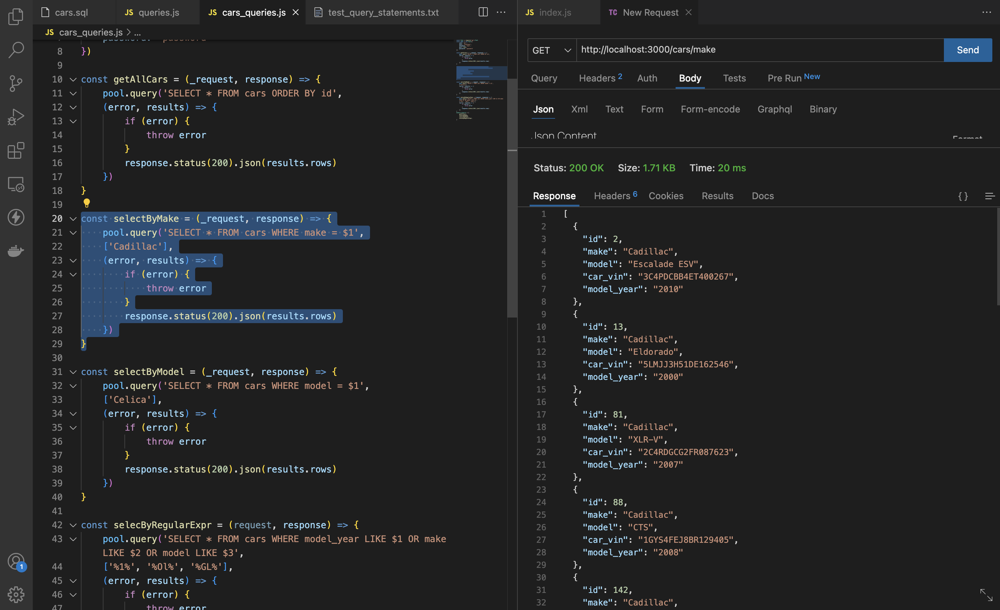

# SQL RELATIONAL DATABASES
Data can be stored in many different formats. An efficient method for storing information is in a database. One common type of database is a relational database, which organizes the data into tables and relates them together using keys.Example of relational databases include the following: Oracle, MySQL, Microsoft SQL Server, PostgreSQL, SQLite, and IBM DB2.

This project seeks quickly demonstrate connecting and accessing data from database using tools like Node.js, Express, Mockaroo, Postgresql.

## YouTube Video
Here is a [link](https://youtu.be/woB71B_Rky0) to a youtube video showing some parts of this project in action.

## Technology Used
- [Node.js](https://nodejs.org/en/)
- [Express](https://expressjs.com/)
- [Node-postgres](https://node-postgres.com/features/types)
- [Postgresql](https://www.postgresql.org/)
- [Mockaroo](https://www.mockaroo.com/)

## References and Credits
- [Node.js, Express, and Postgres](https://blog.logrocket.com/crud-rest-api-node-js-express-postgresql/)
- [Amigoscode](https://amigoscode.com/)

## Picture Time
Below are pictures showing various CRUD operations and there results.

